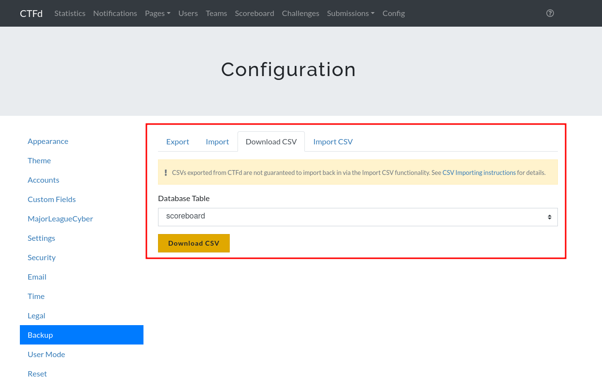

# CTFd scoreboard parser

CTFd scoreboard parser for [CTFtime JSON format](https://ctftime.org/json-scoreboard-feed).

## Getting started

1. Go to your CTFd configuration (example : https://ctf.heroctf.fr/admin/config), then Backup, then Download CSV :



Download the scoreboard database table.

2. Run the python3 script on the downloaded CSV.

Example :

```bash
$ python3 scoreboard_parser.py HeroCTF-scoreboard.csv
{"standings": [{"pos": 1, "team": "Medus'Hack", "score": 16141}, {"pos": 2, "team": "DaVinciCode", "score": 10226}, {"pos": 3, "team": "Hack\u2665\ufe0f", "score": 9621}, {"pos": 4, "team": "La Root'In", "score": 9275}, {"pos": 5, "team": "Les Pires Hat", "score": 9181}, {"pos": 6, "team": "Pizz'Hack", "score": 8177}, {"pos": 7, "team": "Galf Erahs[::-1]", "score": 7844}, {"pos": 8, "team": "IrisSec", "score": 7585}, {"pos": 9, "team": "spy8+9", "score": 7211}, {"pos": 10, "team": "Th3Os", "score": 7089}, {"pos": 11, "team": "glob://al_elite", "score": 6821}, {"pos": 12, "team": "Root66", "score": 6576}, {"pos": 13, "team": "EvilBunnyWrote", "score": 6170}, {"pos": 14, "team": "It just works", "score": 6074}, {"pos": 15, "team": "derust", "score": 6041}, ...
```
